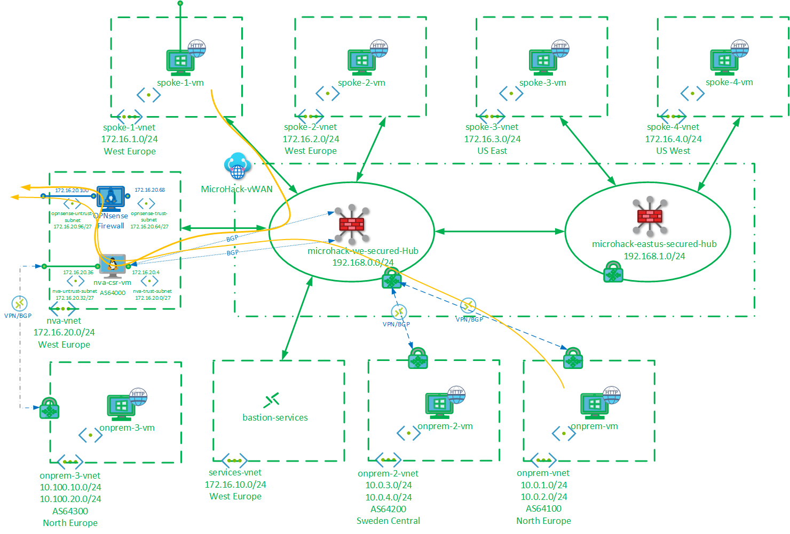
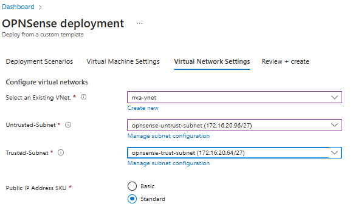

# **Security in Azure Virtual WAN MicroHack**

# Contents

[Introduction](#introduction)

[Objectives](#objectives)

[Lab](#lab)

[Prequisites](#prerequisites)

[Scenario 1: Secure Private Traffic](#scenario-1-secure-private-traffic)

[Scenario 2: Secure Internet Traffic](#scenario-2-secure-internet-traffic)

[Scenario 3: SDWAN through NVA in Spoke](#scenario-3-sdwan-through-nva-in-spoke)

[Scenario 4: Internet through Firewall in Spoke](#scenario-4-internet-through-firewall-in-spoke)

[Close Out](#close-out)

# Introduction
This MicroHack demontrates the newly released [Routing Intent and Routing Policies](https://learn.microsoft.com/en-us/azure/virtual-wan/how-to-routing-policies) capabilities in Azure Virtual WAN. It is a sequel to [Routing in Azure Virtual WAN MicroHack](https://github.com/mddazure/azure-vwan-microhack), and it is recommended to complete Scenario's 1 - 3 of that MicroHack before starting this one.

The lab starts with a dual Secured Hub Virtual WAN, with Spoke VNETs connected but no Security Policies configured.

You will enable Routing Intent and Routing Policies to secure Private and Internet traffic through the firewalls in each Hub.

Next, you add branch two connections (simulated by VNETs with a VPN Gateway) to one hub, and filter branch-to-branch traffic through the hub firewall.

Then a simulated SD-WAN branch location is connected to a Network Virtual Appliance in a spoke; the SD-WAN IP space is dynamically injected into the VWAN through BGP.

Finally, outbound internet traffic is routed through an NVA firewall in a spoke, rather than through the hub firewalls.

# Objectives
After completing this MicroHack you will:
- Understand traffic flow control through Secured Hubs with Azure Firewall. 
- Know how to enable Routing Intent and Private and Internet Routing Policies.
- Know how to leverage the Hub BGP capability to enable an NVA in a spoke.

# Lab

The lab consists of a Virtual WAN with Secured Hubs in West Europe and US East, 4 Spoke VNETs (2 in West Europe, 1 in US East and 1 US West), an NVA VNET in West-Europe and simulated Branch locations in UK South, Sweden-Central and North Europe.

Each of the Spoke and Branch VNETs contains a Virtual Machine running a basic web site.

The NVA VNET contains a Cisco CSR1000v router, which will be used to simulate an SD-WAN concentrator in a Spoke. During the course of the lab, an OPNSense Firewall will be deployed into the NVA VNET to secure outbound internet traffic.

The Services VNET contains a Bastion instance `bastion-service` which is used to connect to VMs across the lab using the IP Connect function.

The lab looks like this (with green components pre-deployed through Terraform, see [Prequisites](#prerequisites) below, and blue parts deployed during the scenarios):

:exclamation: The resources deployed in this lab incur a combined charge of around $170 per day, so do remember to delete the environment when done!

# Prerequisites
To make the most of your time on this MircoHack, the lab in the diagram above is deployed and configured for you through Terraform. You will focus on enabling and inspecting network security through the Azure portal and Cloud Shell.
## Task 1: Deploy
Steps:
- Log in to Azure Cloud Shell at https://shell.azure.com/ and select Bash
- Set environment variables required by Terraform. These should already be present, but may have been removed after an upgrade to Cloud Shell; Terraform will fail if they are not present:
  
  `export ARM_USE_MSI=true`
  
  `export ARM_SUBSCRIPTION_ID=<your sub id>`

  `export ARM_TENANT_ID=<aad tenant id>`

- Ensure Azure CLI and extensions are up to date:
  
  `az upgrade --yes`
  
- If necessary select your target subscription:
  
  `az account set --subscription <Name or ID of subscription>`
  
- Clone the  GitHub repository:
  
  `git clone https://github.com/mddazure/azure-vwan-security-microhack`
  
  - Change directory:
  
  `cd ./azure-vwan-security-microhack/templates`

- Accept the terms for the CSR1000v Marketplace offer:
  
  `az vm image terms accept --urn cisco:cisco-csr-1000v:16_12_5-byol:latest`

- Initialize terraform and download the azurerm resource provider:

  `terraform init`

- Now start the deployment (when prompted, confirm with **yes** to start the deployment):
 
  `terraform apply`

Deployment takes approximately 30 minutes. 

## Task 2: Explore and verify

After the Terraform deployment concludes successfully, the following has been deployed into your subscription:
- A resource group named **vwan-security-microhack-spoke-rg** containing:
  - Four Spoke VNETs, each containing a Virtual Machine running a simple web site.
  - Three Onprem VNETs each containing a Virtual Machine running a simple web site and a VNET Gateway.
  - A Services VNET containing a Bastion Host.
  - An NVA VNET containing a Cisco CSR1000v router.
- A resource group named **vwan-security-microhack-hub-rg** containing:
  - A Virtual WAN resource with two Hubs, each containing an Azure Firewall and a VPN Gateway.
  - A parent firewall policy and child policies for each region.
  - IP Groups for spoke- and branch prefixes, referenced by the firewall policies.

Verify these resources are present in the portal.

Credentials are identical for all VMs, as follows:
- User name: AzureAdmin
- Password: Microhack2023

You may log on to each VM through the Bastion instance in the Services VNET. Navigate to Bastion instance `bastion-service`, click Connect and enter the IP address of the VM you want to connect to:
- spoke-1-vm: 172.16.1.4
- spoke-2-vm: 172.16.2.4
- spoke-3-vm: 172.16.3.4
- spoke-4-vm: 172.16.4.4
- onprem-vm: 10.0.1.4 
- onprem2-vm: 10.0.3.4
- onprem3-vm: 10.0.5.4

Open a command prompt and type `curl localhost`. The response will be the VM name. 

:exclamation: Branch locations onprem, onprem-2 and on-prem-3 are not connected yet, so their VMs will not be reachable from the Bastion instance in the Services VNET.

:exclamation: Connect to nva-csr-vm (the CSR1000v Cisco router) through Serial console from the VM blade in stead of through Bastion. This access method is independent from network connectivity to the VM and avoids the risk of being locked out during configuration changes.

# Scenario 1: Secure Private Traffic
In this scenario, you will secure Spoke-to-Spoke and Branch-to-Spoke traffic accross Secured Hubs in different regions. 
:exclamation: Remember - prior to Routing Intent, securing Spoke-to-Spoke and Branch-to-Spoke traffic through Azure Firewall was restricted to a single Hub; securing traffic across Hubs was not possible.

## Task 1: Baseline
Both Hubs have Azure Firewall deployed, but securing traffic through the firewalls is not yet configured.

Connect to spoke-1-vm, open a command prompt and attempt to connect to the web server on spoke-2-vm at 172.16.2.4, spoke-3-vm at 172.16.3.4 and spoke-4-vm at 172.16.4.4:

`curl 172.16.2.4`

`curl 172.16.3.4`

`curl 172.16.4.4`

❓ Does it connect?

Check the routing table on spoke-1-vm in Cloud Shell:

`az network nic show-effective-route-table -g vwan-security-microhack-spoke-rg -n spoke-1-nic --output table`

Look up the address of the firewall installed in the West Europe hub `microhack-we-hub-firewall`

Observe the next hop for spoke-2-vnet (172.16.2.0/24), spoke-3-vnet (172.16.3.0/24), spoke-4-vnet (172.16.4.0/24).

❓ Do the routes for the Spokes point to the firewall?

## Task 2: Secure Spoke-to-Spoke traffic
Navigate to the West Europe Hub and click Routing Intent and Routing Policies.

In the dropdown under Private Traffic, select Azure Firewall and under Next Hop Resource click `microhack-we-hub-firewall`, then click Save.

Next, navigate to the US East Hub and again click Routing Policies. 

In the dropdown under Private Traffic, select Azure Firewall and under Next Hop Resource click `microhack-useast-hub-firewall`, then click Save.

From spoke-1-vm, again attempt connecting to spoke-2-vm at 172.16.2.4, spoke-3-vm at 172.16.3.4 and spoke-4-vm at 172.16.4.4:

`curl 172.16.2.4`

`curl 172.16.3.4`

`curl 172.16.4.4`

❓ Does it connect?

Navigate to Firewall Policies and inspect each of the policies:

Modify `microhack-fw-parent-policy` so that traffic between spoke-1-vm and spoke-3-vm is no longer blocked by either firewall.

Now navigate back to the West Europe Hub and click Effective Routes. Under Choose resource type select Azure Firewall and under Resource `microhack-we-hub-firewall`:

Inspect the route table, observe routes for directly connected and cross-hub spoke routes.

## Task 3: Secure Branch-to-Branch traffic
Connect simulated Branch locations `onprem` and `onprem-2` to the West Europe Hub, by running these shell scripts from the `./azure-vwan-security-microhack/templates` directory in Cloud Shell:

`./connect-branch.sh`

`./connect-branch2.sh`

The scripts create VPN sites on the West Europe hub, and connect to the VNET Gateways in onprem-vnet and onprem2-vnet.

Connect to onprem-vm via Bastion, open a command prompt and attempt to connect to the web server on onprem2-vm at 10.0.3.4:

`curl 10.0.3.4`

:question: Does it connect?

:question: Can you deduce where the connection from onprem-vm to onprem2-vm is blocked?
Hint: Inspect the `microhack-fw-we-child-policy` firewall policy.

Simulated Branch locations onprem-vnet and onprem2-vnet are both connected to the VPN Gateway on the West Europe hub.

:point_right: Before the Routing Intent update, traffic between Branch S2S VPN connections on the same gateway would loop directly through the gateway and would not be inspected by the firewall in the Hub (red flow in the diagram below). 
Post-RI, traffic from S2S and P2S VPN connections is now forwarded from the gateway to the firewall, allowing Branch-to-Branch connectivity to be controlled centrally by the Hub firewall (orange flow on the diagram).

Navigate to Firewall Policies and update network rules in `microhack-fw-we-child-policy` to permit connectity from onprem-vnet to onprem2-vnet and v.v. 

# Scenario 2: Secure Internet Traffic
You will now secure traffic outbound to internet through the firewall in each Hub. Next you will enable inbound connections from an external client to the web server on the VM in Spoke 4.

## Task 1: Baseline
Connect to spoke-1-vm at 172.16.1.4 via Bastion, open a command prompt and obtain the outbound IP address from ipconfig.io:

`curl ipconfig.io`

❓ Which IP address does it connect from? What resource does this address belong to?

Check the routing on spoke-1-vm in Could Shell:

`az network nic show-effective-route-table -g vwan-security-microhack-spoke-rg -n spoke-1-nic --output table`

❓ Where does the default route point?

Connect to onprem-vm at 10.0.1.4 via Bastion, open a command prompt and obtain the outbound IP address from ipconfig.io:

`curl ipconfig.io`

❓ Which IP address does it connect from? What resource does this address belong to?

## Task 2: Secure outbound

### Configure

Navigate to the West Europe Hub and click Routing Intent and Routing Policies.

In the dropdown under Internet Traffic, select Azure Firewall and under Next Hop Resource click `microhack-we-hub-firewall`, then click Save.

Next, navigate to the US East Hub and again click Routing Policies. 

In the dropdown under Internet Traffic, select Azure Firewall and under Next Hop Resource click `microhack-useast-hub-firewall`, then click Save.

### Verify

From spoke-vm-1, again do `curl ipconfig.io`.

❓ Which IP address does it connect from? What resource does this address belong to?

Check the routing on spoke-1-vm in Could Shell:

`az network nic show-effective-route-table -g vwan-security-microhack-spoke-rg -n spoke-1-nic --output table`

❓ Where does the default route now point?

Now connect to spoke-4-vm via Bastion, open a command prompt and obtain the outbound IP address from ipconfig.io:

`curl ipconfig.io`

❓ Which IP address does it connect from? What resource does this address belong to?

Check the routing on spoke-4-vm in Cloud Shell:

`az network nic show-effective-route-table -g vwan-security-microhack-spoke-rg -n spoke-4-nic --output table`

❓ Where does the default route point?

Connect to onprem-vm at 10.0.1.4 via Bastion, open a command prompt and obtain the outbound IP address from ipconfig.io:

`curl ipconfig.io`

❓ Which IP address does it connect from? Why is the outbound address for this Branch different from the outbound address of the Spokes?

:point_right: Inspect the VPN connection properties: from microhack-we-secured-hub in the portal, navigate to VPN (Site to site), click the elipsis (...) to the right of VPN site onprem1, click Edit VPN connection and look at the selector switches. What should be changed to route internet traffic from the Branch through the Hub firewall?

## Task 3: Secure inbound

You will now enable inbound connectivity from the internet to the web server on spoke-4-vm, through a Destination Network Address Translation (DNAT)
rule on the firewall in the US East hub.

Spoke-4-vm does not have a public IP address and is not directly reachable from the internet. Clients on the internet will send traffic destined for this VM to the hub firewall's public IP address. A DNAT rule on the firewall will translate the destination IP address from the firewall's public IP address into the VM's private IP address. On the return traffic from the VM, the firewall will translate the source address from the VM's private IP into the firewall's public IP, and send it out to the internet.

:point_right: DNAT rules on Azure Firewall also translate the inbound traffic's source address from the client's public IP into the firewall's private IP (Source NAT). This means that the receiving web server will not see the sender's orginal public IP. This is not standard behaviour on all firewall platforms, it is a property of Azure firewall. If masking client IP is undesirable, a recommended architecture for inbound traffic is to route inbound web traffic through Application Gateway in the spoke VNET. Application Gateway also SNAT's the sending client's IP address, but retains it in an x-forwarded-for header. See [Plan for inbound and outbound internet connectivity](https://learn.microsoft.com/en-us/azure/cloud-adoption-framework/ready/azure-best-practices/plan-for-inbound-and-outbound-internet-connectivity) for more information.

Navigate to the firewall in the US East hub, `microhack-useast-hub-firewall` and copy the Firewall public IP.

Navigate to the `microhack-fw-useast-child-policy` firewall policy, and click DNAT rules. Click +Add a rule collection and complete as follows:
- Name: useast-dnat-rule-coll
- Rule collection type: DNAT
- Priority: 150
- Rule collection group: child-useast-rule-coll-grp (select from dropdown)

Under Rules:
- Name: spoke-4-in
- Source type: IP Address
- Source: *
- Protocol: TCP
- Destination Ports: 80
- Destination Type: IP Address
- Destination: [Firewall public IP]
- Translated type: IP Address
- Translated address or FQDN: 172.16.4.4
- Translated port: 80

Click Add.

Wait for the change to complete.

On your laptop, open a command prompt and enter:

`curl [Firewall public IP]`

The response should read "spoke-4-vm".

To observe the DNAT'd and SNAT'd request on the target VM:
- log on to spoke-4-vm, open file explorer and browse to %SystemDrive%\inetpub\logs\LogFiles\W3SVC1
- open the most recent txt file in the directory

Observe log entries for requests sourced from 192.168.1.133 and 192.168.1.134: these are requests SNAT'd by Azure Firewall instances.

# Scenario 3: SDWAN through NVA in Spoke

You will now connect an SD-WAN connection to the Cisco CSR1000v router in nva-vnet. The router will dynamically advertise SD-WAN remote IP space to the West Europe Hub via BGP.

## Task 1: Configure CSR1000v NVA
The CSR1000v NVA is deployed in nva-vnet as nva-csr-vm, but it still needs to be configured. The Cisco IOS configuration is contained in [csr.ios](/templates/csr.ios). The public IP addresses of vnet-gw-onprem3 need to be inserted into the ios configuration, and then the configuration must be copied into the CSR1000v through its command line interface.

- Obtain the IP addresses of `vnet-gw-onprem3-pubip-1` and `vnet-gw-onprem3-pubip-2`, either from the portal, or from Cloud Shell through:

  `az network public-ip show -g vwan-security-microhack-spoke-rg -n vnet-gw-onprem3-pubip-1 --query ipAddress`
  `az network public-ip show -g vwan-security-microhack-spoke-rg -n vnet-gw-onprem3-pubip-2 --query ipAddress`

- Open [csr.ios](/templates/csr.ios) in a text editor and replace the strings "vnet-gw-onprem3-pubip1" and "vnet-gw-onprem3-pubip2" with these IP addresses.

- Log in to nva-csr-vm.

   Use Serial console in the portal as this does not rely on network connectivity in the VNET. Serial console is under Support + troubleshooting in the Virtual Machine blade.

- Enter Enable mode by typing `en` at the prompt, then enter Configuration mode by typing `conf t`.

- Copy and paste the configuration from the modified csr.ios file into the Serial console window, one block at a time.

- Type exit multiple times, until the prompt shows nva-vm-csr#.

  :point_right: Messages warning that BGP peers 192.168.0.68 and 192.168.0.69 are down will now be displayed in the console, because BGP is not yet configured on the West Europe VWAN Hub. This is the next Task. To suppress these warnings, type `no logging console`.

- Save the configuration with `copy run start`, confirm defaults.

Confirm the IPSec tunnels are connected:
- Type `sh ip int brief` and verify Status and Protocol show "up" for  Tunnel101 and Tunnel102.

Confirm routes are learned via BGP:
- Type `sh ip bgp` and verify SDWAN (10.100.x.0/24) routes are present.

## Task 2: Enable BGP peering with Hub
Navigate to the West Europe Hub and click BGP Peers. Click + Add and enter details of the nva-csr-vm BGP peer.

Nva-csr-vm already has matching BGP configuration, it was entered in the previous Task, so the BGP peerings will establish almost immediately.

Inspect the routes learnt by the Hub: click Effective Routes, and in the drop downs select Azure Firewall and microhack-we-hub-firewall.

❓ Can you explain the Next Hop/Origin and Path for each route? Which routes are learned from nva-csr-vm? 

 Now select Route Tables and Default in drop downs.

❓ Can you explain the routes shown?

Log in to nva-scr-vm again.

Confirm routes are learned via BGP:
- Type `sh ip bgp` and verify Spoke (172.16.x.0/24) and Branch (10.0.x.0/24) routes are now also present.

❓ Can you explain the Path for each route?

## Task 3: Verify connectivity
Log on to onprem-3-vm at 10.100.10.4 via Bastion.

Attempt to connect Spoke and Branch VMs:
`curl 172.16.1.4`

`curl 172.16.4.4`

`curl 10.0.1.4`

`curl 10.0.3.4`

❓ Why do these connections fail?

Modify Network rules in child policies microhack-fw-we-child-policy and microhack-fw-parent-policy so that the SDWAN can reach Spokes and Branches.

:point_right: IP Groups for Spoke, Branch and SDWAN prefixes are pre-provisioned and located in the Hub resource group.

Connect to onprem-3-vm at 10.100.10.4 via Bastion, open a command prompt and obtain the outbound IP address from ipconfig.io:

`curl ipconfig.io`

❓ Which IP address does it connect from? Why is the outbound address of the SDWAN site different from the outbound address of the Spokes?

:point_right: Inspect the Effective routes of onprem-3-vm in the portal or in Cloud Shell with
`az network nic show-effective-route-table -g vwan-security-microhack-spoke-rg -n onprem3-nic --output table`
What is the next hop for 0.0.0.0/0?

# Scenario 4: Internet through Firewall in Spoke
You will now deploy add OPNsense firewall into the nva-vnet. Outbound internet traffic from Spokes, Branches and SDWAN will be directed through the CSR1000v router and through the OPNsense firewall, in stead of through the Hub firewalls.

## Task 1: Remove Routing Policy for Internet traffic
This task takes a while to complete.

Navigate to the West Europe Hub and click Routing Intent and Routing Policies.

In the dropdown under Internet Traffic, select None, then click Save.

Do the same for the US East Hub.

## Task 2: OPNsense NVA

### Deploy
This task leverages Daniel Mauser's excellent [OPNsense NVA Firewall in Azure](https://github.com/dmauser/opnazure) lab.

In Cloud Shell, accept the usage terms of FreeBSD Linux:
 
`az vm image terms accept --urn thefreebsdfoundation:freebsd-13_1:13_1-release:13.1.0 -o none`

Then click the button initiate the template:

Complete the configuration screens as shown here:

Review summary on the final screen, and click Create at the bottom:

### Configure
When the deployment is complete, browse to the NVA's public IP address ( OPNsense-PublicIP).
- Username: root
- Password: opnsense (lowercase)

In the left hand bar, click Firewall -> NAT -> Outbound.

In the Manual rules window, click the **+** on the right hand side.

In the next screen, accept all the defaults to create a rule that Source NATs all outbound traffic to WAN IP address of the firewall. Scroll down to Log and tick the box. Scroll down to the bottom and click Save.

:point_right: Click the Apply changes button at the top right to let the rule take effect.

In the left hand bar, now click Rules -> LAN and **+** on the right hand side in the rules window. Again accept all defaults, tick box at Log and click Save at the bottom.

:point_right: Click the Apply changes button at the top right.

The firewall is now configured to Allow and Source NAT all outbound traffic. Feel dree to experiment with otjher rules.

## Task 3: Advertise default route from CSR1000v NVA

### Configure nva-csr-vm
The CSR will now advertise the default route both into the West Europe Hub and toward the SDWAN site. All internet traffic will flow to the CSR, and it will route it out it's "outside" interface, GigabitEthernet2.

Log on to nva-csr-vm via Serial console.

Type `en` to enter enablement mode. The route already has a default route pointing to GigebitEthernet2, verify this by inspecting the routing table with `sh ip route`. 

However, this route is not advertised over BGP, verify this by inspecting advertised routes to one of the BGP peers with `sh ip bgp neighbors 192.168.0.68 adverised-routes`.

To start advertising the default route, a network statement needs to be added to the bgp configuration.

Type `conf t` to enter configuration mode, then `router bgp 64000`.
Then type `network 0.0.0.0 mask 0.0.0.0` and `exit`.

Verify that the default route is now advertised by again inspecting routes advertised to BGP peers.

Save the configuration with `copy run start`.

### Verify
Verify that the default route is learned by the West Europe Hub.

Navigate to the West Europe Hub and click Effective Routes. Under Choose resource type select Azure Firewall and under Resource microhack-we-hub-firewall.

The default route should be lsited with Next Hop Type HubBgpConnection and Next Hop the BGP connection to the CSR.

Now go the East US Hub and inspect the firewall effective routes.

.

Note that the default route points directly to Internet.

:point_right: The default route is not advertised between Hubs. Cross-hub internet access is not possible and aach Hub must implement its own, local internet break out facility.

### User Defined Routes
#### NVA VNET
As we want outbound traffic to be secured by the OPNsense firewall, we need a UDR on the nva-untrusted subnet to push the traffic to the firewall's trusted or inside interface. However, the SDWAN IPSec tunnel traffic should not be firewalled, so the UDR must contain an explicit route to send traffic for `vnet-gw-onprem3` to the internet directly.

The UDR is pre-provisioned in the `vwan-security-microhack-spoke-rg` Resource Group, but still needs to be attched to the subnet.

Navigate to `nva-vnet`, click subnets and select `nva-untrust-subnet`. Under Route table select `nva-untrust-udr`.

Return traffic from the OPNsense firewall must be directed back to the CSR1000v's untrusted interface. Another UDR to achieve this is pre-provisioned in the `vwan-security-microhack-spoke-rg` Resource Group, but still needs to be attched to the OPNsense trusted subnet.

Navigate to `nva-vnet`, click subnets and select `opnsense-trust-subnet`. Under Route table select `nva-untrust-udr`.

#### Spoke VNETs
With the Internet Routing Policy now disabled, the Hub no longer programs the default route in the Spoke VNETs - even though it learns a default route via BGP from the CSR1000v NVA in nva-vnet.

To force internet traffic from Spokes to the Hub, we need a UDR in each spoke containing a default route pointing to the Azure Firewall load balancer address in the Hub. The route table on the firewall subnet has the default route advertised by the NVA, and internet traffic is sent through the NVA, **not** Azure Firewall.

Navigate to `spoke-1-vnet`, click subnets and select `vm-subnet`. Under Route table select `spoke-1-udr`.

### Verify
Log in to `spoke-1-vm` at 172.16.1.4 via Bastion.

Open a command prompt and retrieve the outbound IP address from ipconfig.io.

`curl ipconfig.io`

❓To which element does the IP address returned belong?

# Close Out
Steps to safely and completely delete the lab:
- Dissociate the firewall policies from the hub firewalls
- Delete the child policies
- Delete the parent policy
- Delete the Hub resource group `microhack-we-secured-hub`
- Once the Hub resource group is completely removed, delete the Spoke resource group `vwan-security-microhack-spoke-rg`
