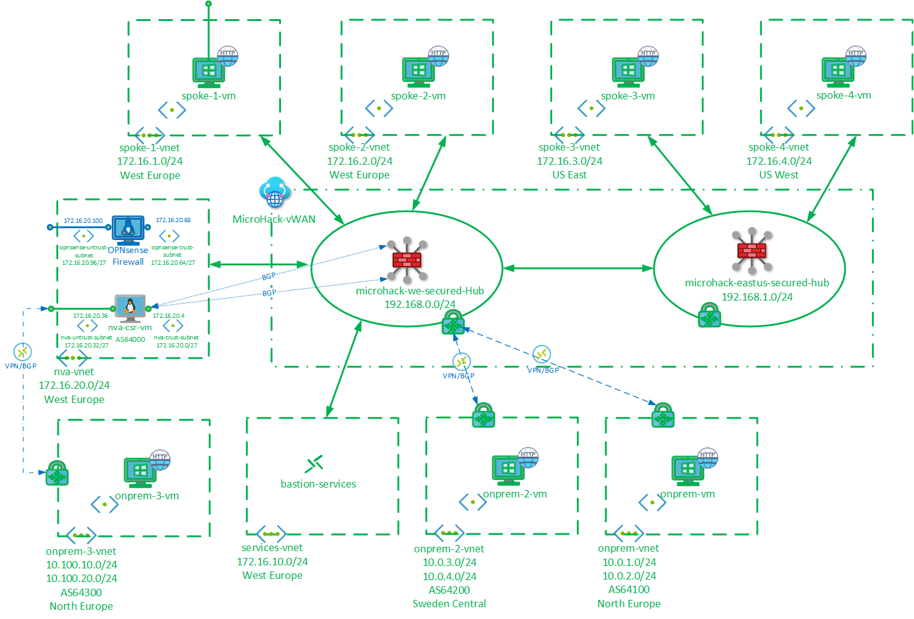

# **Security in Azure Virtual WAN MicroHack**

[Introduction](#introduction)

[Objectives](#objectives)

[Lab](#lab)

[Prequisites](#prerequisites)

[Scenario 1](#scenario-1)

[Scenario 2](#scenario-2)

[Scenario 3](#scenario-3)

[Scenario 4](#scenario-4)

[Close Out](#close-out)

# Contents

# Introduction
This MicroHack demontrates the newly released [Routing Intent and Routing Policies](https://learn.microsoft.com/en-us/azure/virtual-wan/how-to-routing-policies) capabilities in Azure Virtual WAN. It is a sequel to [Routing in Azure Virtual WAN MicroHack](https://github.com/mddazure/azure-vwan-microhack), and it is recommended to complete Scenario's 1 - 3 of that MicroHack before starting this one.

The lab starts with a dual Secured Hub Virtual WAN, with Spoke VNETs connected but no Security Policies configured. We will then enable policies to secure Private and Internet traffic through the firewalls in each Hub. Next, we add a branch connection (simulated by a VNET with a VPN Gateway). Then we add a Network Virtual Appliance in a spoke, and direct traffic outbound to internet through this device in stead of through the hub firewall. Finally, we connect a branch location to the NVA through VPN to simulate an SD-WAN, dynamically inject the SD-WAN IP space into VWAN and secure traffic to the SD-WAN connection through the Hub firewalls.

# Objectives
After completing this MicroHack you will:
- Understand traffic flow control through Secured Hubs with Azure Firewall 
- Know how to enable Routing Intent and Private and Internet Routing Policies
- Know how to leverage the Hub BGP capability to enable an NVA in a spoke

# Lab

The lab consists of a Virtual WAN with Secured Hubs in West Europe and US East, 4 Spoke VNETs (2 in West Europe, 1 in US East and 1 US West), an NVA VNET in West-Europe and simulated Branch locations in North Europe and Sweden-Central.

Each of the Spoke and Branch VNETs contains a Virtual Machine running a basic web site. 

The NVA VNET contains a Cisco CSR1000v router, which will be used to simulate an SD-WAN concentrator in a Spoke. During the course of the lab, an OPNSense Firewall deployed into the NVA VNET to secure outbound internet traffic.

The lab looks like this (with green components pre-deployed through Terraform (see [Prequisites](#prerequisites) below) and blue parts deployed during the scenarios):

# Prerequisites
To make the most of your time on this MircoHack, the lab in the diagram above is deployed and configured for you through Terraform. You will focus on enabling and inspecting network security through the Azure portal and Cloud Shell.
## Task 1: Deploy
Steps:
- Log in to Azure Cloud Shell at https://shell.azure.com/ and select Bash
- Set environment variables required by Terraform. These should already be present, but may have been removed after an upgrade to Cloud Shell; Terraform will fail if they are not present:
  
  `export ARM_USE_MSI=true`
  
  `export ARM_SUBSCRIPTION_ID=<your sub id>`

  `export ARM_TENANT_ID=<aad tenant id>`

- Ensure Azure CLI and extensions are up to date:
  
  `az upgrade --yes`
  
- If necessary select your target subscription:
  
  `az account set --subscription <Name or ID of subscription>`
  
- Clone the  GitHub repository:
  
  `git clone https://github.com/mddazure/azure-vwan-security-microhack`
  
  - Change directory:
  
  `cd ./azure-vwan-security-microhack`
  - Initialize terraform and download the azurerm resource provider:

  `terraform init`

- Now start the deployment (when prompted, confirm with **yes** to start the deployment):
 
  `terraform apply`

Deployment takes approximately 30 minutes. 

# Scenario 1

# Scenario 2

# Scenario 3

# Scenario 4

# Close Out

